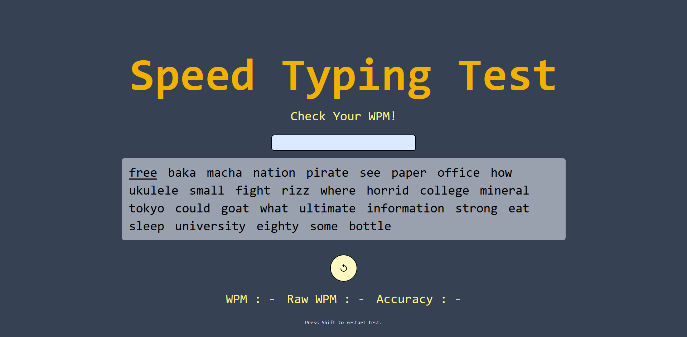

# Speed Typing Test ⌨️⚡

A simple and interactive **typing speed test** built with **React**.
It measures **Words Per Minute (WPM)**, **Raw WPM**, and **Accuracy**,
while giving you a smooth typing experience.

## 🚀 Features

-   ⏱️ **30-second timer** that starts when you begin typing.
-   🔀 **Random word generation** from a predefined list.
-   🧮 Real-time calculation of:
    -   WPM (based on correct characters typed)
    -   Raw WPM (total typed characters regardless of correctness)
    -   Accuracy percentage
-   🟢 Visual feedback:
    -   Correct letters highlighted ✅
    -   Incorrect letters highlighted ❌
-   🔄 Reset anytime by pressing **Shift** or using the restart button.
-   📱 Responsive design (works on desktop and mobile).

## 🛠️ Tech Stack

-   [React](https://react.dev/) with **Vite**
-   React Context API (for managing words and timer state)
-   Tailwind CSS (for styling)

## 📂 Project Structure

    .
    ├── index.html
    ├── assets/
    │    └── screenshot.png
    ├── src/
    │   ├── App.jsx              # Main app logic
    │   ├── main.jsx             # Entry point
    │   ├── contexts/
    │   │   └── WordContext.jsx  # Provides words + timer via Context API
    │   ├── components/
    │   │   ├── WordBox.jsx      # Displays words & highlights letters
    │   │   └── Timer.jsx        # Standalone timer (unused in App)

## ▶️ Getting Started

### 1. Clone the repository

``` bash
git clone https://github.com/Irfan-Mazhar/Speed-Typing-Test.git
cd Speed-Typing-Test
```

### 2. Install dependencies

``` bash
npm install
```

### 3. Run the development server

``` bash
npm run dev
```

Open your browser at **http://localhost:5173** (or the URL shown in
terminal).

## 🎮 How to Play

1.  Start typing in the input box --- the timer will begin
    automatically.
2.  Type as many words as you can before time runs out.
3.  Check your **WPM, Raw WPM, and Accuracy** stats.
4.  Press **Shift** or click the **restart button** to try again.

## 📸 Screenshot


